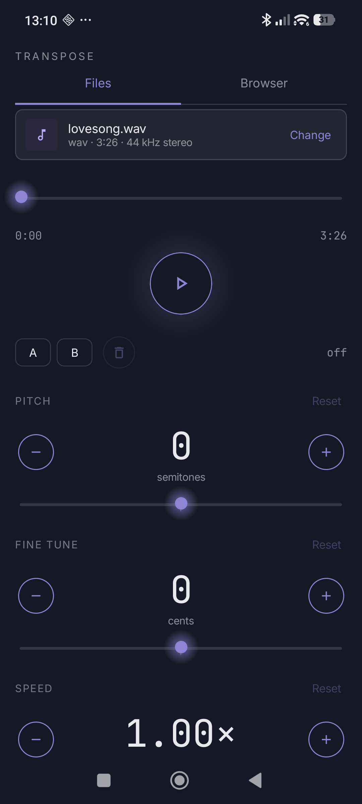
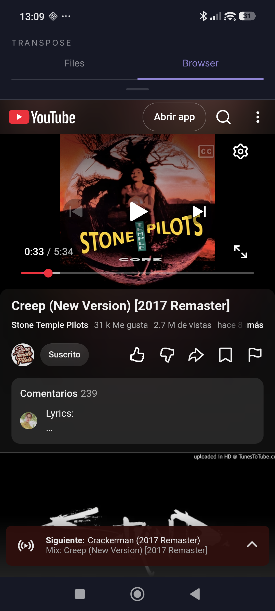
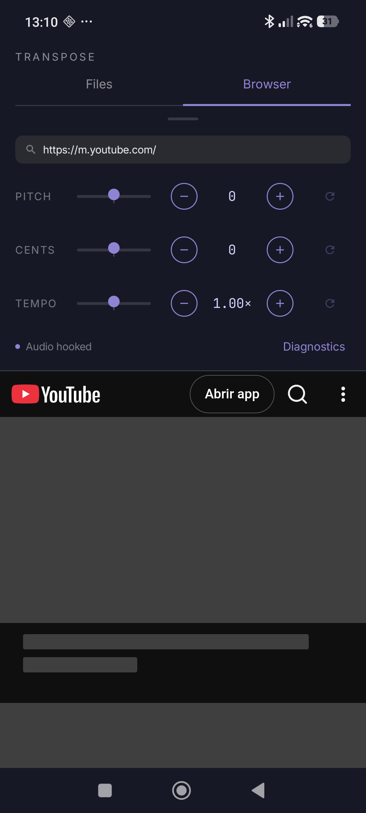

# Transpose

A personal Android app for changing the **pitch** and **playback speed** of
audio independently and in real time — on **(A) local audio files**, and
**(B) YouTube videos** played inside a built-in browser. Personal project,
not published on the Play Store.

<p align="center">
  
  
  
</p>

## Features

### Files mode

- Pick any local audio file (`mp3`, `m4a`, `wav`, `flac`) via the system
  file picker — no broad storage permission needed.
- Real-time pitch shift, **−12 to +12 semitones**, decoupled from speed.
- Fine-tune pitch in **cents** (±50, i.e. up to half a semitone either way)
  on top of the coarse semitone control, for exact intonation matching.
- Independent speed control, **0.25× to 4×**, powered by the same
  time-stretching engine (so speed changes don't affect pitch unless you
  want them to).
- **A/B loop**: mark two points in the track and loop between them
  indefinitely — useful for drilling a specific section on repeat.

### Browser mode (YouTube)

- A real address bar — type a URL, a bare domain, or a search phrase (falls
  back to a Google search) — not a YouTube-only search box.
- The same pitch (±12 semitones, ±50 cents fine-tune) and tempo (0.5×–2×)
  controls as Files mode, applied live to whatever video is playing.
- Tempo uses the browser's native `video.playbackRate`, which is
  pitch-preserving by default — so tempo and pitch are fully independent,
  the same as in Files mode.
- **Ad-blocking**: rather than blocking by domain (YouTube serves its own
  video ads from the same infrastructure as real video, specifically to
  defeat that), the app intercepts YouTube's player-response JSON and
  strips the ad-describing fields out of it before YouTube's own code reads
  it — the same technique uBlock Origin uses internally. A DOM-based
  fallback (auto-clicking the skip button, or hard-skipping) catches ads
  stitched directly into the video stream, which no JSON-level block can
  touch.
- Forces YouTube's own dark theme, independent of the system theme.
- Fixes a subtle YouTube-in-WebView bug where **comments never render**:
  Android tags its WebViews with a `; wv` marker in the user-agent, and
  Google sites quietly serve a reduced experience to it. Stripped.
- **Full-screen video**, with the system status/navigation bars hidden to
  match, restored automatically on exit.
- The pitch/tempo/URL panel is **collapsible** — swipe it away to let the
  video take the full screen, tap the handle to bring the controls back.
- **Mutual exclusion**: playing a local file automatically pauses whatever
  is playing in the browser, and vice versa, so the two audio engines never
  overlap.

## How it works

Two independent pipelines share one Compose UI shell (`Files` / `Browser`
tabs), each solving "pitch-shift this audio" in a different way because
they start from a different kind of source.

**Files.** `MediaExtractor`/`MediaCodec` decodes the file to raw PCM, which
is fed through the [Rubber Band Library](https://breakfastquay.com/rubberband/)
(vendored in `app/src/main/cpp/rubberband/`, built via NDK/CMake, driven
through its own official JNI bridge) for real time-domain pitch/time
shifting, and the result is streamed out through `AudioTrack`. The A/B loop
is just a position check on the same read loop that feeds the decoder.

**Browser.** A `WebView` loads the requested page. JavaScript is injected at
*document-start* (before any of the page's own scripts run, via
`WebViewCompat.addDocumentStartJavaScript`) that:

1. Finds the page's active `<video>` element and connects it to a Web Audio
   graph: `MediaElementAudioSourceNode → pitch-shift node → destination`.
   This is a genuine replacement of the video's audio path, not an overlay —
   confirmed the video is not CORS-tainted inside the app's own WebView, so
   real samples flow through, not silence.
2. Pitch-shifts through [`@soundtouchjs/core`](https://github.com/cutterbl/SoundTouchJS)
   (bundled with esbuild into a dependency-free script), driven by a plain
   `ScriptProcessorNode` rather than the modern `AudioWorkletNode` — YouTube's
   Content-Security-Policy blocks `audioWorklet.addModule()` from loading a
   worklet module, so the deprecated-but-still-supported API is what's left.
3. Re-hooks itself whenever YouTube swaps the active video (SPA navigation,
   autoplay, Shorts swipes) through several redundant triggers, since no
   single DOM event reliably fires for every case.
4. Strips ads from the player-response JSON before YouTube's own code reads
   it, and forces the dark-theme cookie.

Native (Kotlin) controls reach the page through
`window.TransposeControl.set*()`, called via `WebView.evaluateJavascript()`;
the page reports back (hook status, audio level, ad-block events, video
play/pause state) through a `window.TransposeBridge` JavaScript interface.

## Project structure

```
app/src/main/
├── cpp/
│   ├── CMakeLists.txt
│   └── rubberband/                       — vendored, do not edit (third-party import)
├── assets/
│   └── soundtouch-scriptprocessor.js     — Browser mode's pitch engine, bundled with esbuild
└── java/
    ├── com/breakfastquay/rubberband/
    │   └── RubberBandStretcher.kt        — 1:1 binding to the official JNI bridge (Files mode)
    └── com/realtimetranspose/
        ├── MainActivity.kt               — tab shell (Files / Browser), file picker (SAF)
        ├── audio/                        — Files mode
        │   ├── AudioFileDecoder.kt       — MediaExtractor/MediaCodec → PCM float
        │   ├── PitchShiftEngine.kt       — semitones/speed over RubberBandStretcher
        │   └── TransposePlayer.kt        — decode → shift → AudioTrack pipeline
        ├── browser/                      — Browser mode
        │   ├── AdBlockScript.kt          — strips ads from YouTube's player JSON + DOM fallback
        │   ├── BrowserProbeBus.kt        — observable state (hook/level/ad-block/playback)
        │   └── TransposeJsBridge.kt      — JS → Kotlin bridge
        └── ui/
            ├── FilePlayerScreen.kt       — Compose: picker, transport, pitch/cents/speed, loop
            ├── BrowserScreen.kt          — Compose: WebView + pitch/cents/tempo, URL bar, fullscreen
            ├── components/               — shared "Nocturne" design system pieces
            └── theme/                    — colors, type scale, spacing
```

## Building it

```bash
./gradlew installDebug
```

Requires the Android NDK (for the Rubber Band build) and a device or
emulator running Android 8.0 (API 26) or newer. No API keys or backend of
any kind — everything runs on-device.

## License note

Rubber Band Library is GPLv2+ (or commercial) licensed; it's vendored here
under GPLv2+ terms, which is fine for this personal, non-distributed project
but would need a commercial license to ship on the Play Store or otherwise
distribute the app. `@soundtouchjs/core` is MPL-2.0.
